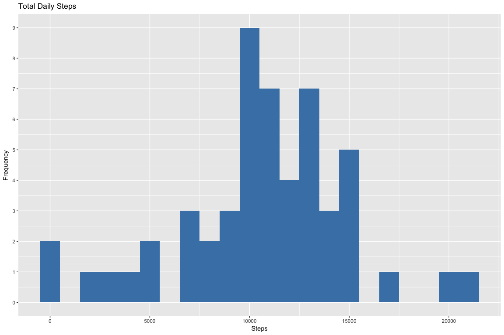
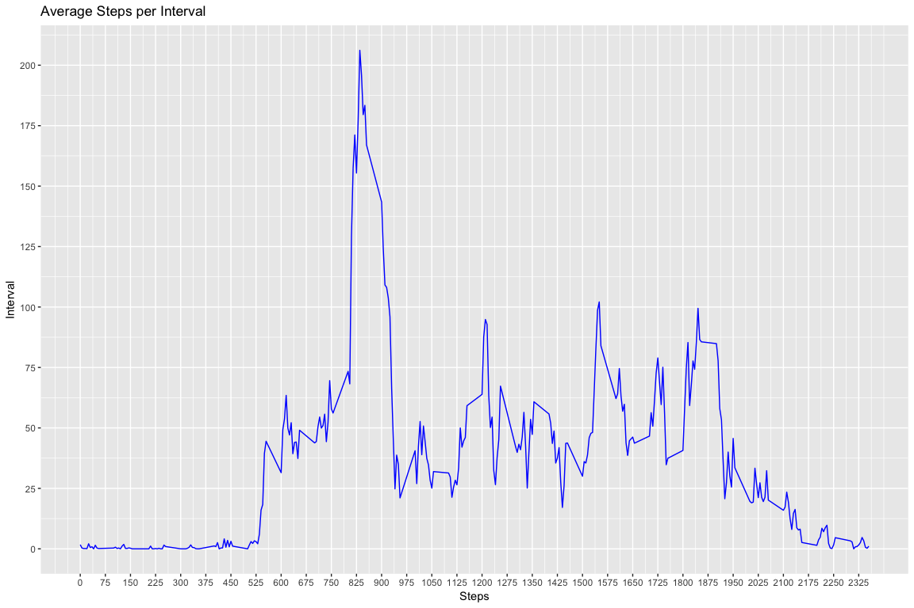
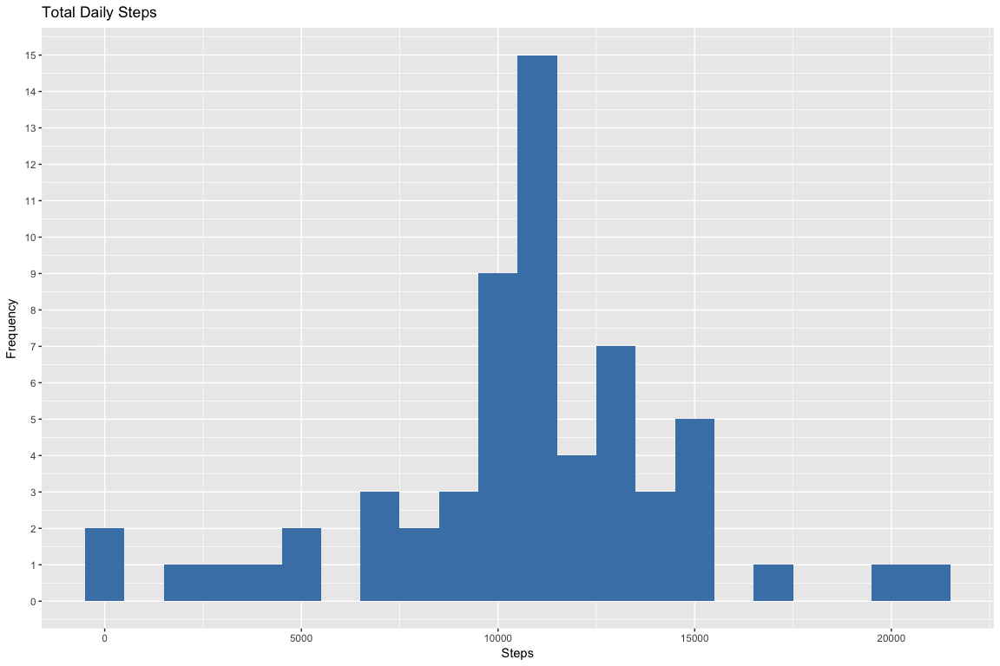
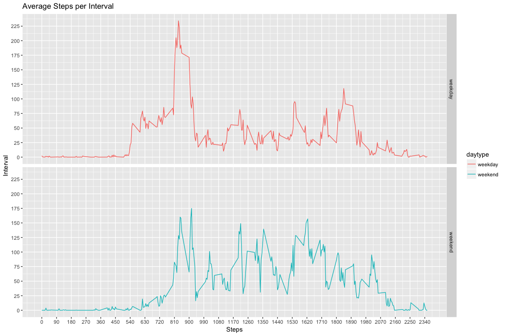

## Loading and preprocessing the data


```r
# Unzip and load the data on to an OBject
unzip("dataset.zip")
file_path <- file.path("./", "UCI HAR Dataset")
temp_data <- read.csv2("activity.csv", sep = ",")
```


```r
#Dimension of Raw data
dim(temp_data)
```

```
## [1] 17568     3
```

```r
#Summary of Raw data
summary(temp_data)
```

```
##      steps                date          interval     
##  Min.   :  0.00   2012-10-01:  288   Min.   :   0.0  
##  1st Qu.:  0.00   2012-10-02:  288   1st Qu.: 588.8  
##  Median :  0.00   2012-10-03:  288   Median :1177.5  
##  Mean   : 37.38   2012-10-04:  288   Mean   :1177.5  
##  3rd Qu.: 12.00   2012-10-05:  288   3rd Qu.:1766.2  
##  Max.   :806.00   2012-10-06:  288   Max.   :2355.0  
##  NA's   :2304     (Other)   :15840
```


```r
# Convert date field to Date class
temp_data$date <- as.Date(as.character(temp_data$date))

# remove records with NA
data <- na.omit(temp_data)
```

## What is mean total number of steps taken per day?

#### 1. Calculate the total number of steps taken per day

```r
# Group data by 'Date' and Sum up Steps by the grouping
data_by_date <- group_by(data, date)
steps_by_date <- summarise(data_by_date, sum(steps))
summary(steps_by_date)
```

```
##       date              sum(steps)   
##  Min.   :2012-10-02   Min.   :   41  
##  1st Qu.:2012-10-16   1st Qu.: 8841  
##  Median :2012-10-29   Median :10765  
##  Mean   :2012-10-30   Mean   :10766  
##  3rd Qu.:2012-11-16   3rd Qu.:13294  
##  Max.   :2012-11-29   Max.   :21194
```

```r
names(steps_by_date)[2] <- "Steps"

# First 15 records of the cleaned up data
head(steps_by_date, 15)
```

```
## # A tibble: 15 x 2
##          date Steps
##        <date> <int>
##  1 2012-10-02   126
##  2 2012-10-03 11352
##  3 2012-10-04 12116
##  4 2012-10-05 13294
##  5 2012-10-06 15420
##  6 2012-10-07 11015
##  7 2012-10-09 12811
##  8 2012-10-10  9900
##  9 2012-10-11 10304
## 10 2012-10-12 17382
## 11 2012-10-13 12426
## 12 2012-10-14 15098
## 13 2012-10-15 10139
## 14 2012-10-16 15084
## 15 2012-10-17 13452
```

#### 2. Make a histogram of the total number of steps taken each day

```r
# Plot for the Mean of total number of steps per day
ggplot(steps_by_date, aes(steps_by_date$Steps)) + 
geom_histogram(fill = "steelblue", binwidth=1000) + 
labs(title = "Total Daily Steps", x = "Steps", y = "Frequency") + scale_y_continuous(breaks = seq(0, 10, by=1)) 
```

<!-- -->

#### 3. Calculate and report the mean and median of the total number of steps taken per day

```r
# Mean of Steps per day
mean(steps_by_date$Steps)
```

```
## [1] 10766.19
```

```r
# Median of Steps per day
median(steps_by_date$Steps)
```

```
## [1] 10765
```

## What is the average daily activity pattern?

```r
# Group data by 'Interval' and calculate the Average Steps by the grouping
data_by_interval <- group_by(data, interval)
steps_by_interval <- summarise(data_by_interval, mean(steps))
summary(steps_by_interval)
```

```
##     interval       mean(steps)     
##  Min.   :   0.0   Min.   :  0.000  
##  1st Qu.: 588.8   1st Qu.:  2.486  
##  Median :1177.5   Median : 34.113  
##  Mean   :1177.5   Mean   : 37.383  
##  3rd Qu.:1766.2   3rd Qu.: 52.835  
##  Max.   :2355.0   Max.   :206.170
```

```r
names(steps_by_interval)[2] <- "Steps"

# First 15 records of the cleaned up data
head(steps_by_interval, 15)
```

```
## # A tibble: 15 x 2
##    interval     Steps
##       <int>     <dbl>
##  1        0 1.7169811
##  2        5 0.3396226
##  3       10 0.1320755
##  4       15 0.1509434
##  5       20 0.0754717
##  6       25 2.0943396
##  7       30 0.5283019
##  8       35 0.8679245
##  9       40 0.0000000
## 10       45 1.4716981
## 11       50 0.3018868
## 12       55 0.1320755
## 13      100 0.3207547
## 14      105 0.6792453
## 15      110 0.1509434
```

#### 1. Make a time series plot (i.e. 𝚝𝚢𝚙𝚎 = "𝚕") of the 5-minute interval (x-axis) and the average number of steps taken, averaged across all days (y-axis)

```r
# Plot for the Mean of total number of steps per day
ggplot(steps_by_interval, aes(interval, Steps)) + 
geom_line(color="blue") + 
labs(title = "Average Steps per Interval", x = "Steps", y = "Interval") + 
scale_x_continuous(breaks = seq(0, 2355, by=75)) + 
scale_y_continuous(breaks = seq(0, 225, by=25)) 
```

<!-- -->

#### 2. Which 5-minute interval, on average across all the days in the dataset, contains the maximum number of steps?

```r
steps_by_interval[which.max(steps_by_interval$Steps),]
```

```
## # A tibble: 1 x 2
##   interval    Steps
##      <int>    <dbl>
## 1      835 206.1698
```


## Imputing missing values

##### 1. Calculate and report the total number of missing values in the dataset (i.e. the total number of rows with 𝙽𝙰s)

```r
sum(is.na(temp_data$steps))
```

```
## [1] 2304
```

##### 2. Devise a strategy for filling in all of the missing values in the dataset. The strategy does not need to be sophisticated. For example, you could use the mean/median for that day, or the mean for that 5-minute interval, etc.,

```r
# Raw input data 
imputed_data <- temp_data
# Imput the missing Steps with the mean of steps by Interval 
imputed_data$steps[is.na(imputed_data$steps)] <- mean(steps_by_interval$Steps)
```

#### 3. Create a new dataset that is equal to the original dataset but with the missing data filled in.


```r
# Summary of imputed data
summary(imputed_data)
```

```
##      steps             date               interval     
##  Min.   :  0.00   Min.   :2012-10-01   Min.   :   0.0  
##  1st Qu.:  0.00   1st Qu.:2012-10-16   1st Qu.: 588.8  
##  Median :  0.00   Median :2012-10-31   Median :1177.5  
##  Mean   : 37.38   Mean   :2012-10-31   Mean   :1177.5  
##  3rd Qu.: 37.38   3rd Qu.:2012-11-15   3rd Qu.:1766.2  
##  Max.   :806.00   Max.   :2012-11-30   Max.   :2355.0
```

```r
# First 15 entries of imputed data  
head(imputed_data, 15)
```

```
##      steps       date interval
## 1  37.3826 2012-10-01        0
## 2  37.3826 2012-10-01        5
## 3  37.3826 2012-10-01       10
## 4  37.3826 2012-10-01       15
## 5  37.3826 2012-10-01       20
## 6  37.3826 2012-10-01       25
## 7  37.3826 2012-10-01       30
## 8  37.3826 2012-10-01       35
## 9  37.3826 2012-10-01       40
## 10 37.3826 2012-10-01       45
## 11 37.3826 2012-10-01       50
## 12 37.3826 2012-10-01       55
## 13 37.3826 2012-10-01      100
## 14 37.3826 2012-10-01      105
## 15 37.3826 2012-10-01      110
```

#### 4. Make a histogram of the total number of steps taken each day and Calculate and report the mean and median total number of steps taken per day. Do these values differ from the estimates from the first part of the assignment? What is the impact of imputing missing data on the estimates of the total daily number of steps?

```r
# Group imputed data by 'Date' and Sum up Steps by the grouping
imputed_data_by_date <- group_by(imputed_data, date)
imputed_steps_by_date <- summarise(imputed_data_by_date, sum(steps))
summary(imputed_steps_by_date)
```

```
##       date              sum(steps)   
##  Min.   :2012-10-01   Min.   :   41  
##  1st Qu.:2012-10-16   1st Qu.: 9819  
##  Median :2012-10-31   Median :10766  
##  Mean   :2012-10-31   Mean   :10766  
##  3rd Qu.:2012-11-15   3rd Qu.:12811  
##  Max.   :2012-11-30   Max.   :21194
```

```r
names(imputed_steps_by_date)[2] <- "Steps"

# First 15 records of the cleaned up imputed data
head(imputed_steps_by_date, 15)
```

```
## # A tibble: 15 x 2
##          date    Steps
##        <date>    <dbl>
##  1 2012-10-01 10766.19
##  2 2012-10-02   126.00
##  3 2012-10-03 11352.00
##  4 2012-10-04 12116.00
##  5 2012-10-05 13294.00
##  6 2012-10-06 15420.00
##  7 2012-10-07 11015.00
##  8 2012-10-08 10766.19
##  9 2012-10-09 12811.00
## 10 2012-10-10  9900.00
## 11 2012-10-11 10304.00
## 12 2012-10-12 17382.00
## 13 2012-10-13 12426.00
## 14 2012-10-14 15098.00
## 15 2012-10-15 10139.00
```


```r
# Plot for the Mean of total number of steps per day of the imputed data
ggplot(imputed_steps_by_date, aes(Steps)) + 
geom_histogram(fill = "steelblue", binwidth=1000) + 
labs(title = "Total Daily Steps", x = "Steps", y = "Frequency") + scale_y_continuous(breaks = seq(0, 20, by=1)) 
```

<!-- -->


```r
# Mean of Steps per day
mean(imputed_steps_by_date$Steps)
```

```
## [1] 10766.19
```

```r
# Median of Steps per day
median(imputed_steps_by_date$Steps)
```

```
## [1] 10766.19
```


## Are there differences in activity patterns between weekdays and weekends?
#### 1. Create a new factor variable in the dataset with two levels – “weekday” and “weekend” indicating whether a given date is a weekday or weekend day.

```r
# create a new dataframe with day of week and the "weekend" or "weekday" type
weekday_data <- temp_data
weekday_data$day <- weekdays(weekday_data$date)
weekday_data$daytype <- ifelse(weekday_data$day == "Saturday" | weekday_data$day == "Sunday", "weekend", "weekday")

# Summary of dataframe with Type of Day
summary(weekday_data)
```

```
##      steps             date               interval          day           
##  Min.   :  0.00   Min.   :2012-10-01   Min.   :   0.0   Length:17568      
##  1st Qu.:  0.00   1st Qu.:2012-10-16   1st Qu.: 588.8   Class :character  
##  Median :  0.00   Median :2012-10-31   Median :1177.5   Mode  :character  
##  Mean   : 37.38   Mean   :2012-10-31   Mean   :1177.5                     
##  3rd Qu.: 12.00   3rd Qu.:2012-11-15   3rd Qu.:1766.2                     
##  Max.   :806.00   Max.   :2012-11-30   Max.   :2355.0                     
##  NA's   :2304                                                             
##    daytype         
##  Length:17568      
##  Class :character  
##  Mode  :character  
##                    
##                    
##                    
## 
```

```r
# First 15 records of the cleaned up data with type of day in a week
head(weekday_data, 15)
```

```
##    steps       date interval    day daytype
## 1     NA 2012-10-01        0 Monday weekday
## 2     NA 2012-10-01        5 Monday weekday
## 3     NA 2012-10-01       10 Monday weekday
## 4     NA 2012-10-01       15 Monday weekday
## 5     NA 2012-10-01       20 Monday weekday
## 6     NA 2012-10-01       25 Monday weekday
## 7     NA 2012-10-01       30 Monday weekday
## 8     NA 2012-10-01       35 Monday weekday
## 9     NA 2012-10-01       40 Monday weekday
## 10    NA 2012-10-01       45 Monday weekday
## 11    NA 2012-10-01       50 Monday weekday
## 12    NA 2012-10-01       55 Monday weekday
## 13    NA 2012-10-01      100 Monday weekday
## 14    NA 2012-10-01      105 Monday weekday
## 15    NA 2012-10-01      110 Monday weekday
```

#### 2. Make a panel plot containing a time series plot (i.e. 𝚝𝚢𝚙𝚎 = "𝚕") of the 5-minute interval (x-axis) and the average number of steps taken, averaged across all weekday days or weekend days (y-axis). See the README file in the GitHub repository to see an example of what this plot should look like using simulated data.

```
##     interval        daytype              Steps        
##  Min.   :   0.0   Length:576         Min.   :  0.000  
##  1st Qu.: 588.8   Class :character   1st Qu.:  1.854  
##  Median :1177.5   Mode  :character   Median : 26.295  
##  Mean   :1177.5                      Mean   : 39.208  
##  3rd Qu.:1766.2                      3rd Qu.: 62.321  
##  Max.   :2355.0                      Max.   :234.103
```

```
## Classes 'grouped_df', 'tbl_df', 'tbl' and 'data.frame':	576 obs. of  3 variables:
##  $ interval: int  0 0 5 5 10 10 15 15 20 20 ...
##  $ daytype : chr  "weekday" "weekend" "weekday" "weekend" ...
##  $ Steps   : num  2.333 0 0.462 0 0.179 ...
##  - attr(*, "na.action")=Class 'omit'  Named int [1:2304] 1 2 3 4 5 6 7 8 9 10 ...
##   .. ..- attr(*, "names")= chr [1:2304] "1" "2" "3" "4" ...
##  - attr(*, "vars")= chr "interval"
##  - attr(*, "drop")= logi TRUE
```

```
## # A tibble: 6 x 3
## # Groups:   interval [3]
##   interval daytype     Steps
##      <int>   <chr>     <dbl>
## 1        0 weekday 2.3333333
## 2        0 weekend 0.0000000
## 3        5 weekday 0.4615385
## 4        5 weekend 0.0000000
## 5       10 weekday 0.1794872
## 6       10 weekend 0.0000000
```

<!-- -->
